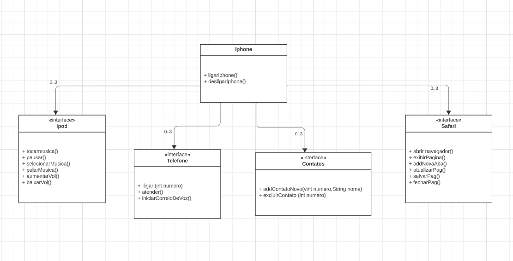

# Diagramação de Classes do Iphone

Com base no vídeo de lançamento do iPhone conforme link abaixo, elabore em uma ferramenta de UML de sua preferência a diagramação das classes e interfaces com a proposta de representar os papéis do iPhone de: Reprodutor Musicial, Aparelho Telefônico e Navegador na Internet. Em seguida crie as classes e interfaces no formato de arquivos .java

🔗 
[Apresentação Iphone](https://www.youtube.com/watch?v=9ou608QQRq8)

## Sobre:
Realizei a criação das classes Iphone e interfaces Ipode (para músicas), Telefone para as funções principais, Contatos para organizar os mesmos, e Safari para representar as funções de navegação.

## 💹 UML

